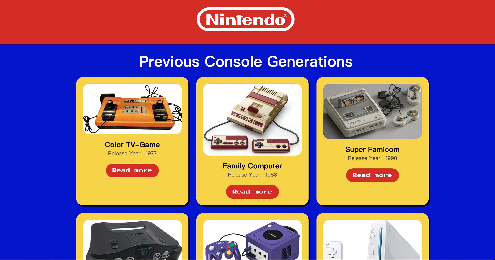

# 🎮 Nintendo Consoles Showcase

A Vue 3 + custom API powered website to showcase the history of Nintendo consoles!  
You can browse through generations of Nintendo consoles and view their detailed features.



## 🚀 Features

- Browse historical Nintendo consoles (name, release year, image)
- Click on a console card to view detailed features
- Spinning loader animation while data is loading
- Vue 3 + custom Lumen API integration
- Smooth animations with GSAP and ScrollTrigger

## 🛠️ Built With

- **Frontend Framework**: Vue 3
- **Backend API**: Lumen (PHP Micro Framework)
- **CSS**: Grid layout + custom styles
- **Animations**: GSAP, ScrollTrigger
- **Development Environment**: MAMP + Macㄋ

## 📦 Installation & Setup

1. Clone the repository
```bash
git clone https://github.com/your-username/nintendo-consoles.git
cd nintendo-consoles